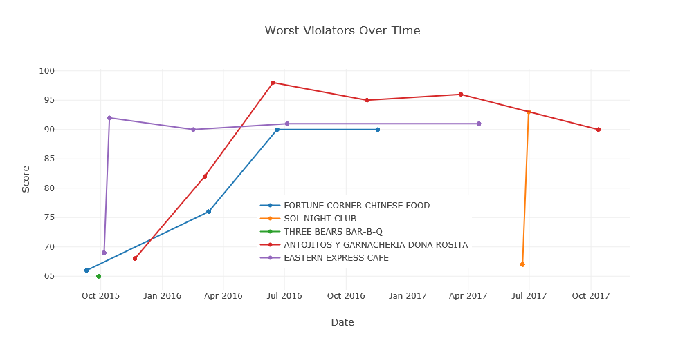
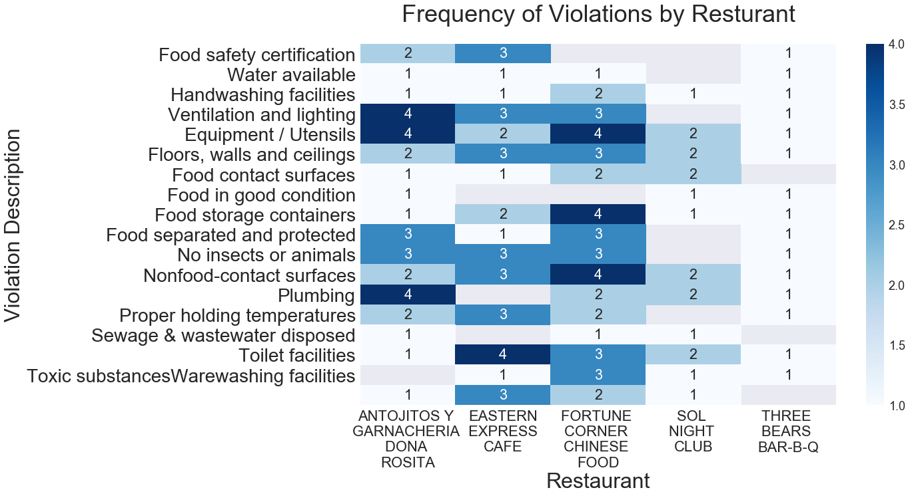

# How-restaurants-handle-violations-in-LA

<b> Analysis of Restaurant Health Violations </b>

In this project we look at health inspection visits to different restaurants and the scores the restaurants get. Our focus in this project is to examine how the worst scoring restaurants perform overtime and what violations they make.

### Tech Stack
- Matplotlib
- Jupyter Notebook
- seaborn
- pandas

### Process
We used factorplot to depict the most common violations and draw trend of score with pyplot to analyze the impact of inspection. 

Also, we applied the heatmap to generate insights of violations these Restaurants have trouble fixing and greatest impact on score.

### Findings

1. This project reveals that TEREE BEARS BAR-B-Q got the worst score: 65 in LA.

2. There seem to be three kinds of responses that resturants take. One is to procrastinate and put off correcting all the violations until they have to be inspected again. The second is to immediatly correct most of the worst violations, the last is to just close down because they cannot correct the violations. But each of these resturants also never reach a perfect score. They just aim for 90 or an A and just stop.

3. Comparing heatmaps of the count and point losing, we found the most common violations of the worst are related to the equipment, however, these violations are not the main reason that they lose many points in the inspection. Most of the points that are lost are due to poor termperature for holding foods and pests in the restaurant. If you don't want to have a bad score on your health inspection, you have to focus on having proper temperatures and keeping pests away. 

4. According to this project, performance of 2016 is better than other years. The scores for 2016 are higher than the average.

5. This analysis surprisingly found that the most common violation of restaurants is related to temperature (shown as below). Be careful about temperature if you running a restaurant.

*Refer to this link to see the plotly plots:http://nbviewer.jupyter.org/github/DarrellShih/Resturant-Violations-Vizualization-Project/blob/master/DV_Notebook/DV_GroupProject_Final_F4.ipynb
